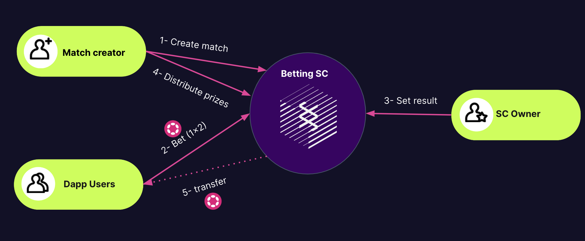

# Betting Smart Contract
[](https://github.com/paritytech/ink)

## Overview
This pallet implements a basic protocol for decentralized betting build using the ink! programming language.

Every account can create a match where rest of the users can bet. To create a match it is needed to place a deposit that will be returned after distribute the prizes.

The number of bets a user can create now are limited to 1.

Everyone can bet in the match, for a basic result: victory team 1, draw or victory team 2.

When the match is over the user that has created the contract can set the result of the match.

## How to test it
Run the tests:
```shell
cargo +nightly test
```

Build the WebAssembly for the contract:
```shell
cargo +nightly contract build
```

## A diagram


:warning: It is **not a production-ready smart contract**, but a sample built for learning purposes. It is discouraged to use this code 'as-is' in a production environment.

## Messages

### `create_match_to_bet`:
 Creates a match to bet on.
#### Parameters:
  * `team1` – Name of the first team.
  * `team2` – Name of the second team.
  * `start` – Time when the match starts and a bet can not be placed (in blocks).
  * `lenght` – Duration of the match (in blocks).

### `bet`:
Create bet for a match.
#### Parameters:
  * `match_id` – Id of the match, in our case the creator of the bet accountId.
  * `amount_to_bet` – Amount placed for the bet.
  * `result` – The result for the bet.

### `set_result`:
Notify the result of an existing match.
The can only be called by the creator of the Smart Contract.
#### Parameters:
  * `match_id` – Id of the match, in our case the creator of the match accountId.
  * `result` – The result of the match.

### `distribute_winnings`:
When a match ends someone the owner of the match can distribute the money from the winers and delete the match.
Distribute winnings: take all the prizes on the pot and distribute the prizes evenly. 

Example:

Person A bets 10 UNITS on team1.

Person B bets 10 UNITS on team2.

Person C bets 30 UNITS on team1.

The total Pot is 50 UNITS.

If team1 is the winner, with weighted distribution the person A have to receive the 25% of the pot and the person C the 75%. The maths for this weighted distribution are simple: the amount that one deposit / the total amount of the winners deposit in the case of Person A = 10/40 = 0.25